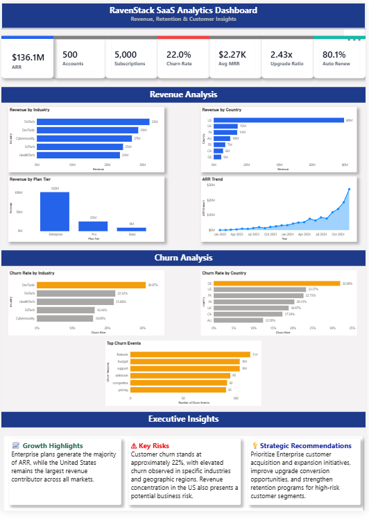
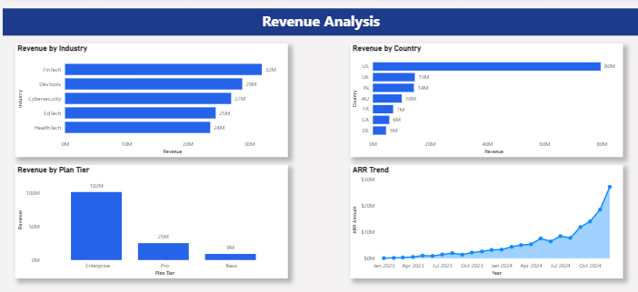
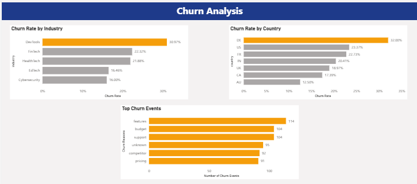

# 🚀 SaaS Customer Analytics Dashboard

An end-to-end Business Intelligence and Data Analytics project focused on analyzing SaaS customer behavior, subscription revenue, and churn trends using Python and Power BI.

This project transforms raw operational data into actionable business insights through Exploratory Data Analysis (EDA), KPI monitoring, interactive dashboarding, and strategic recommendations.

---

## 📌 Business Problem

SaaS companies rely heavily on recurring revenue and customer retention for sustainable growth.

RavenStack wanted to answer critical business questions:

* Which customer segments generate the most revenue?
* Which industries and countries contribute the highest ARR?
* What are the major churn drivers?
* Which customer groups are at the highest retention risk?
* How can the company improve recurring revenue growth?

This project was built to provide management with a data-driven view of business performance and customer retention.

---

## 🎯 Project Objectives

* Analyze Annual Recurring Revenue (ARR) performance.
* Understand customer churn behavior.
* Evaluate industry and geographic performance.
* Identify growth opportunities and business risks.
* Build an executive-ready Power BI dashboard.

---

## 🛠 Tech Stack

### Data Analysis

* Python
* Pandas
* NumPy

### Data Visualization

* Matplotlib
* Power BI

### Business Intelligence

* DAX
* KPI Design
* Dashboard Development

---

## 📊 Dashboard Features

### Executive KPI Overview

The dashboard provides real-time visibility into:

* Total Accounts
* Total ARR
* Churn Rate
* Average MRR
* Total Subscriptions
* Auto-Renew Percentage
* Upgrade-to-Downgrade Ratio

---

### Revenue Analysis

Revenue performance is analyzed across:

* Industries
* Countries
* Subscription Plans
* Annual Revenue Trends

Business users can quickly identify high-performing customer segments and revenue concentration risks.

---

### Churn Analysis

Customer retention is evaluated using:

* Churn Rate by Industry
* Churn Rate by Country
* Top Churn Reasons

The dashboard highlights high-risk customer segments and potential retention opportunities.

---

### Executive Insights

The project concludes with business-focused insights and strategic recommendations designed for executive decision-making.

---

## 📈 Key Findings

### Revenue

* Enterprise plans generate the highest share of Annual Recurring Revenue.
* FinTech contributes the largest industry-level revenue.
* The United States accounts for the majority of ARR.

### Customer Retention

* Overall churn rate is approximately 22%.
* DevTools customers exhibit the highest churn rate.
* Germany shows the highest churn rate among analyzed countries.

### Business Risk

* Revenue is heavily concentrated in the US market.
* Churn is distributed across multiple factors rather than a single dominant cause.

---

## 💡 Strategic Recommendations

### Growth

Expand Enterprise customer acquisition and upsell programs to maximize recurring revenue growth.

### Risk Reduction

Reduce dependency on a single geographic market by increasing customer acquisition efforts in additional regions.

### Retention

Implement targeted retention initiatives for high-churn customer segments, particularly DevTools customers.

### Revenue Expansion

Increase upgrade conversion opportunities and encourage greater adoption of auto-renew subscriptions.

---

## 📂 Repository Structure

```text
saas-customer-analytics-dashboard
│
├── data/
├── notebooks/
├── dashboard/
├── screenshots/
├── presentation/
├── reports/
└── README.md
```

---

## 🖼 Dashboard Preview

### Full Dashboard



### Revenue Analysis



### Churn Analysis



---

## 📚 Skills Demonstrated

* Data Cleaning
* Exploratory Data Analysis
* Business Intelligence
* KPI Design
* Dashboard Development
* Data Storytelling
* Business Recommendations
* Power BI
* DAX
* Python Analytics

---

## 👨‍💻 Author

**Rudra Patel**

Computer Engineering Student | Aspiring Data Analyst | Business Intelligence Enthusiast

GitHub: (Add Link)
